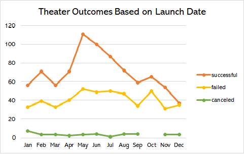

# Analysis of Kickstarter Data
## Overview of Project 

This project analyzes Kickstarter campaign data of NUMBER campaign from DATE to DATE. The analysis explores the data for campaigns specifically under the theater parent category and further, the plays subcategory. Anaylsis was done through Excel. 
The purpose of this project is to analyze success rates of Kickstarter campaigns, specifically campaigns under the theater parent category and further, the plays subcategory.

## Analysis and Challenges 

The analysis was performed by looking at the data through two perspectives: theater outcomes based on launch date and play outcomes based on goals.  
#### Analysis of Theater Outcomes Based on Launch Date
The data was disaggregated by parent category and launch date. 

From this perspective, the data shows that the largest proportion, 13 percent, of all successful theater campaigns were launched in May. In contrast, the lowest proportion, four percent, of successful theater campaigns were launched in December. While the highest proportion of failed theater campaigns were launched in May, July, and October, the high number of successful campaigns that launched in May suggest that May would be the best time to launch a Kickstarter campaign for theater fundraisers.   

#### Analysis of Play Outcomes Based on Goals
Campaign goals were grouped into 12 bands. The first band included goals less than $1,000. The following ten bands increased in increments of $4,999. The last band included goals over $50,000.

#### Challenges and Difficulties Encountered
## Results 
Answer the following questions in complete and coherent sentences.
- What are two conclusions you can draw about the Theater Outcomes based on Launch Date?
- What can you conclude about the Outcomes based on Goals?
- What are some limitations of this dataset?
- What are some other possible tables and/or graphs that we could create?
