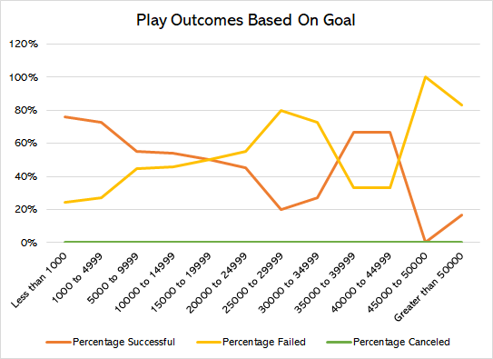

# Analysis of Kickstarter Data
## Overview of Project 
This project analyzes Kickstarter campaign data of 4,113 campaigns from 2010 to 2017 across 19 countries. The analysis explores emerging patterns for campaigns under the theater parent category and further, the plays subcategory. Analysis was done through Excel. 
## Analysis and Challenges 
The analysis was performed by looking at the data through two perspectives: theater outcomes based on launch date and play outcomes based on goals.  
#### Analysis of Theater Outcomes Based on Launch Date
The data was disaggregated by outcomes and launch date. 

In this graph, campaigns in the theater parent category were disaggregated by their outcome (successful, failed, or canceled) and the month of launch. From this perspective, the data shows that the largest proportion, 13 percent, of all successful theater campaigns were launched in May. In contrast, the lowest proportion, four percent, of successful theater campaigns were launched in December. While the highest proportion of failed theater campaigns were launched in July, October, and also May the high number of successful campaigns that launched in May suggest that May would be the best time to launch a Kickstarter campaign for theater fundraisers.   

#### Analysis of Play Outcomes Based on Goals
The data was also disaggregated by subcategory and goal. 

Campaign goals were grouped into 12 bands. The first band included goals less than $1,000. The following ten bands increased in increments of $4,999. The last band included goals over $50,000. The graphs shows percentages of play campaign outcomes within each goal band. From this perspective, the highest proportion of successful campaigns, 75 percent, occurred within the less than 1,000 band. In contrast, the highest proportion of failed campaigns, 100 percent, occurred in the 45,000 to 50,000 band. Two bands, 35,000 to 39,999 and 40,000 to 44,999, both have 66 percent successful campaigns. Given that these two bands differ largely from the first band but still have a high proportion of successful campaigns, it is difficult to make assumptions about what this data says about goals and if goals are a predictor of outcome. 
#### Challenges and Difficulties Encountered
A challenge met during this analysis occurred while manually inputting formulas for Play Outcomes Based On Goal graph. Because this process consisted of entering a formula for each cell, the data was subject to human error. To compensate, a pivot table using the same groups was created to confirm the results. 
## Results 
### Conclusions
Given results of Theater Outcomes Based on Launch Date, the data suggests that the best time to launch a theater campaign would be in May. Contrastly, the data suggests the most inopportune time would be December. 

Conversely, the results from Play Outcomes Based on Goal are harder to define. Because high proportions of play campaigns occur in the less than 1,000, 35,000 to 39,999, and 40,000 to 44,999 bands, the large range between the band make it difficult to predict an outcome of a given campaign based on goal. 
### Limitations 
Limitations of this dataset that should be considered are:
- methods that campaigns utilized to advertise, what methods were most successful for each campaign
- pledge rewards provided to donors
- specific location beyond country (i.e., urban vs. rural)
- confirmation that the data provided does not exclude any data 
### Further Investigation
This analysis would benefit from further investigation to draw a clearer picture about theater and play campaigns. Important factors that were not examined in this analysis that should be considered are duration of campaign (duration vs. outcome), number of backers (backers vs. outcome), and average donation size (average donation vs. goal). 
